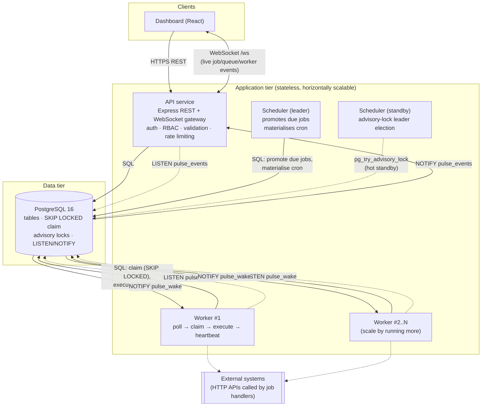
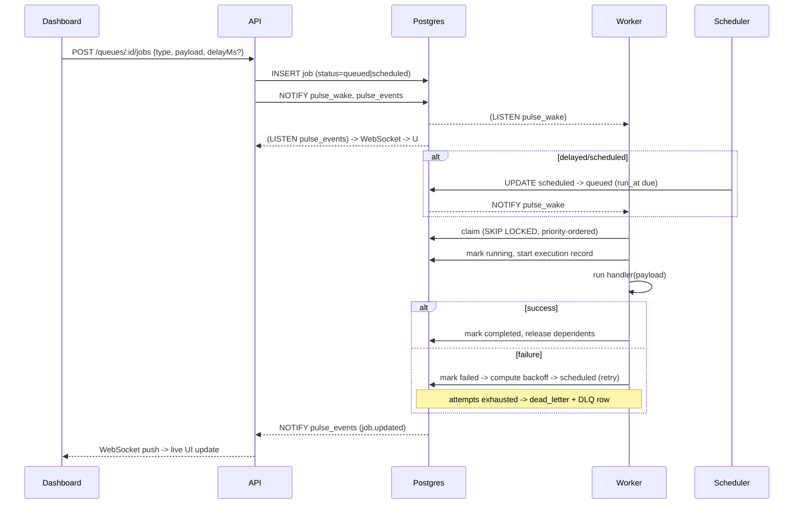

# Architecture

## Component diagram

## Why three separate services instead of one monolith

| Service | Responsibility | Scaling axis |
|---|---|---|
| **API** | Auth, CRUD, validation, RBAC, read models, WebSocket fan-out | scale with request traffic |
| **Worker** | Claim + execute jobs, heartbeat, crash recovery (reaper) | scale with job throughput / CPU |
| **Scheduler** | Promote due jobs, materialise cron schedules | never needs more than one *active* instance |

Splitting them means a burst of job execution (CPU-heavy `demo.compute`,
slow `http.request` calls) never starves API request latency, and the
scheduler — which must not double-fire a cron schedule — can run as a
singleton without limiting how many workers or API replicas exist. All three
communicate exclusively through PostgreSQL: no message broker, no shared
memory, no service-to-service RPC. This keeps the system's correctness
guarantees anchored to the database's transactional guarantees instead of a
second consistency model.

## Postgres as the coordination substrate

Three Postgres primitives do the work usually spread across Postgres + Redis
+ RabbitMQ/Kafka + ZooKeeper:

1. **`SELECT ... FOR UPDATE SKIP LOCKED`** — atomic job claiming. Two workers
   racing for the same row: one gets it, the other's `SKIP LOCKED` silently
   passes over it and claims something else. No duplicate execution, no
   external lock service.
2. **Advisory locks (`pg_advisory_lock` / `pg_try_advisory_xact_lock`)** —
   scheduler leader election (session-level lock, released automatically if
   the leader's connection dies) and claim-transaction serialization
   (transaction-level lock, see [DESIGN-DECISIONS.md](DESIGN-DECISIONS.md)).
3. **`LISTEN` / `NOTIFY`** — event-driven wake-ups. Workers poll on a slow
   fallback interval but usually wake up within milliseconds of a job
   becoming runnable; the API's WebSocket gateway subscribes once and fans
   out to every connected browser.

## Request/data flow: creating and running a job

## Failure isolation and recovery

- **Worker crash mid-job**: the reaper (running inside every worker process,
  serialized by an advisory lock so only one sweep executes at a time) detects
  workers whose heartbeat lease expired and requeues their in-flight jobs.
  See [DESIGN-DECISIONS.md § delivery semantics](DESIGN-DECISIONS.md).
- **Scheduler crash**: the standby instance's blocked `pg_try_advisory_lock`
  call succeeds the moment the dead leader's connection closes (Postgres
  releases session-level advisory locks on disconnect) — failover is
  automatic, no health check wiring required.
- **API crash**: stateless; a load balancer in front of multiple replicas
  is transparent to workers and the scheduler, which never talk to the API.
- **Database is the single point of failure** by design — see the trade-off
  discussion in DESIGN-DECISIONS.md for why this was accepted for this scope.
